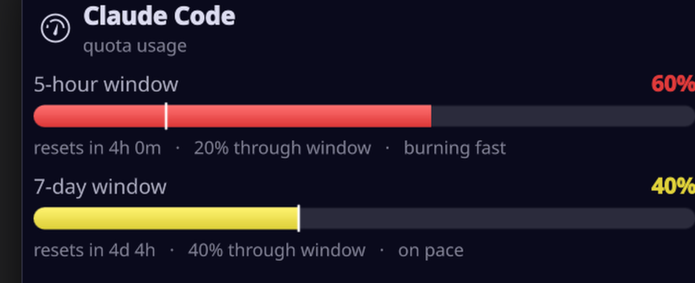
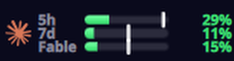

# Claude Meter

> [!NOTE]
> **There's now one widget for all of them.** [AI Meter](https://github.com/matpb/ai-meter) shows Claude (any number of accounts), Codex, Grok and Cursor in a single KDE Plasma widget, with an optional Android home screen widget. New work happens there. This widget keeps working, and its reader script lives on inside AI Meter. The macOS SwiftBar plugin stays here.

A KDE Plasma panel widget that shows your **live Claude usage** — the 5-hour and 7-day
subscription windows, plus an opt-in per-model weekly window (Fable) when your plan has one — as
compact bars, colored by how you're tracking against the clock.


It reads your usage straight from claude.ai, so it's always fresh, counts usage from **every device**
(phone, web, other machines), and costs **zero tokens** — it's a read-only status check, not a prompt.

---

## Who this is for

- You're on **KDE Plasma 6** (the widget is a Plasma applet and reads the browser key from **KWallet**).
  It won't work on GNOME, Xfce, etc. **On macOS**, see [`swiftbar/`](swiftbar/) — a SwiftBar menu bar
  port with the same bars, reading the browser key from the login Keychain.
- You have a **Claude subscription** (Pro / Max) — those are the plans with rolling 5-hour and 7-day
  usage windows. (API-only accounts don't have these windows.)
- You use a **Chromium-based browser** (Chrome, Chromium, Brave, Vivaldi) that is **logged into
  claude.ai**. That session is what the widget reads.

Works great whether or not you use Claude Code — it reads your account usage, not any one tool's.

## What the bars tell you



Each bar packs four signals:

| Element | Meaning |
|---|---|
| **Fill length** | How much of that window's quota you've used (`60%`). |
| **Vertical tick** | How far *through the window by time* you are. Fill **left** of the tick = you're under pace; fill **right** of it = burning fast. |
| **Color** | Pace, not raw usage: **green** = comfortably under, **yellow** = right on the clock, **red** = ahead of the clock. So 90% used with 95% of the window elapsed still reads calm; 40% used at hour one reads hot. |
| **↺ marker** | The window just reset — the live number may still be catching up. |

Hover for exact numbers, reset countdowns and pace; click to open the detail popup above.

### The per-model (Fable) window

Plans with a model-specific weekly cap (today that's **Fable**, capped at a share of your weekly
limit) get a third window. It is hidden everywhere by default; enable **Configure → Appearance →
Show the per-model window** to get it in the hover text and popup, then pick how it shows in the
panel with **Bars in the panel**:



The bar reads claude.ai's `weekly_scoped` limit, so it follows whatever model Anthropic scopes next
without a widget update. The offline statusline fallback has no per-model window, so the bar hides
while the widget is running on cached data.

When the reading is not live, the panel shows a **disconnected-plug badge reading “cached”** — the live claude.ai fetch failed and the bars are coming from the Claude Code statusline snapshot, which only counts *this machine*. If that fallback also goes stale (older than ten minutes) the bars
dim and the badge switches to a clock with the reading's age. Hover for the reason and the fix.

This matters because a fresh fallback is otherwise indistinguishable from a live reading: the
snapshot gets rewritten every few seconds, so a dead live path used to render as a perfectly
healthy widget. The badge is what makes the degradation visible.

## Requirements

- KDE Plasma **6**
- A Chromium-based browser logged into claude.ai, with its "Safe Storage" key in **KWallet** (KDE default)
  or the Secret Service / gnome-keyring
- CLI tools: `jq`, `sqlite3`, `openssl`, `curl`, `python3`, `qdbus` (Qt 6), `kpackagetool6`

Install the CLI deps if you don't have them:

```bash
# Fedora KDE
sudo dnf install jq sqlite openssl curl python3 qt6-qttools kf6-kpackage
# Arch
sudo pacman -S jq sqlite openssl curl python qt6-tools
# openSUSE
sudo zypper install jq sqlite3 openssl curl python3 qt6-tools
```

## Install

```bash
git clone https://github.com/matpb/claude-meter.git
cd claude-meter
./install.sh
```

The installer registers the plasmoid and offers to drop it straight into your top panel. If you'd
rather add it by hand: right-click your panel → **Add Widgets…** → search **Claude Meter**.

No configuration needed — it auto-detects your Claude organization and your browser on first run.
Running two subscriptions? See [Two subscriptions, two meters](#two-subscriptions-two-meters).

## How it works

1. Every ~90 seconds the widget runs its bundled reader (`contents/scripts/claude-meter.sh`).
2. **First it tries the OAuth access token Claude Code already stores** at
   `~/.claude/.credentials.json` (or `CLAUDE_CREDENTIALS`) and calls
   `https://api.anthropic.com/api/oauth/usage` with it — no browser, no wallet unlock. A
   missing or expired token just falls through to the next step silently.
3. Otherwise the reader finds your browser's cookie store, reads the "Safe Storage" key from KWallet
   (or the Secret Service), and **decrypts your claude.ai session cookie in memory**, then calls
   `https://claude.ai/api/organizations/<your-org>/usage` (the same endpoint the web app's usage
   screen uses) and turns the 5-hour / 7-day windows into the bars.
4. If any of that can't run, it falls back to an optional local snapshot (see below) and the widget
   shows its staleness.

The session cookie is used **only in memory**, sent **only to claude.ai over HTTPS**, and is **never
written to disk or logged**. The only thing cached locally is your organization's UUID, in
`~/.config/claude-meter/org_id`.

## Optional: offline fallback via a Claude Code statusline

Purely optional, and only relevant if you run Claude Code with a custom statusline. Claude Code hands
its statusline a JSON blob containing your rate-limit windows; caching that gives the widget a
last-known snapshot for when the live fetch can't run. See [`extras/statusline-cache.sh`](extras/statusline-cache.sh)
for the one-line hook.

## Configuration (all optional)

Everything auto-detects. These environment variables only exist as overrides:

| Variable | Purpose |
|---|---|
| `CLAUDE_CREDENTIALS` | Path to a `.credentials.json` holding `.claudeAiOauth.accessToken`, for the OAuth-token rung (default: alongside `CLAUDE_USAGE_DIR`'s parent). |
| `CLAUDE_ORG_ID` | Force a specific claude.ai organization UUID instead of auto-detecting. |
| `CLAUDE_CHROME_COOKIES` | Path to a specific browser `Cookies` SQLite DB. |
| `CLAUDE_USAGE_DIR` | Where to read the optional statusline fallback snapshot (default `~/.claude/usage`). |
| `CLAUDE_METER_DEBUG=1` | Print diagnostics to stderr — run the reader by hand to see why the live fetch fails. |

## Two subscriptions, two meters

Each Claude subscription is its own claude.ai login, so keep each one in its own browser profile.
Then add a second **Claude Meter** to the panel and, in **Configure → Account**, point it at that
profile. The page lists every Chromium profile it finds (browser, profile name, Google account), so it
is a pick from a dropdown, not a path hunt. Give each meter a name and, if you like, its own icon:

| Option | What it does |
|---|---|
| **Account name** | Shown in the hover text and the popup ("Claude · Work"). |
| **Browser profile** | Which cookie store to read the claude.ai session from. Auto-detect takes the first profile logged in. |
| **Statusline snapshot dir** | Offline fallback for that account. If it runs Claude Code under its own `CLAUDE_CONFIG_DIR`, use `<that dir>/usage`. |
| **Panel icon** | Any SVG or PNG in place of the Claude mark. The quickest way to tell two meters apart at a glance. |

Each meter keeps its own organization cache, so two instances never mix accounts.

## Options

Right-click the widget → **Configure Claude Meter…** → **Appearance**:

| Option | Default | What it does |
|---|---|---|
| **Show the Claude icon** | on | Puts the Claude mark in front of the bars. Handy when you run this next to the sibling widget and want to tell them apart at a glance. |
| **Tint it to match the panel** | off | Renders the mark in your panel's text colour instead of the brand colour. |
| **Show the window labels** | on | The "5h" / "7d" captions. Turn off to reclaim panel width once the icon makes it obvious which widget is which. |
| **Show the per-model window (Fable)** | off | Enables the per-model window everywhere — hover, popup and (if picked below) the panel. |
| **Bars in the panel** | 5-hour and 7-day | Which windows get a panel bar; only enabled once the per-model window is on. |

## Uninstall

```bash
./uninstall.sh
```

Then right-click the widget in your panel → **Remove**.

## Troubleshooting

Run the reader by hand with diagnostics:

```bash
CLAUDE_METER_DEBUG=1 ~/.local/share/plasma/plasmoids/org.mat.claudemeter/contents/scripts/claude-meter.sh
```

- **`no session cookie`** — make sure you're logged into claude.ai in a supported browser and that
  KWallet is unlocked.
- **Bars are dimmed with a clock** — the live fetch failed and it's showing the last cached snapshot.
- **Nothing updates** — restart the shell: `kquitapp6 plasmashell && kstart plasmashell`.

## See also

[**`swiftbar/`**](swiftbar/) — the macOS menu bar port of this widget, in this repo.

[**Codex Meter**](https://github.com/matpb/codex-meter) and
[**Grok Meter**](https://github.com/matpb/grok-meter) — the same widget for Codex and SuperGrok.
The three are fully independent; run any combination.

## Disclaimer

This is an **unofficial** tool and is not affiliated with or endorsed by Anthropic. It reads an
undocumented claude.ai endpoint using your own logged-in session, which could change at any time. Use
it for your own account only.

## Icon

The bundled Claude mark comes from [Simple Icons](https://simpleicons.org) (icon files are CC0).
The trademark itself belongs to Anthropic; this project is unaffiliated and only uses the mark to
label which service the bars are reporting on.

## License

MIT — see [LICENSE](LICENSE). Copyright © 2026 [Mathieu-Philippe Bourgeois](https://matpb.com).
